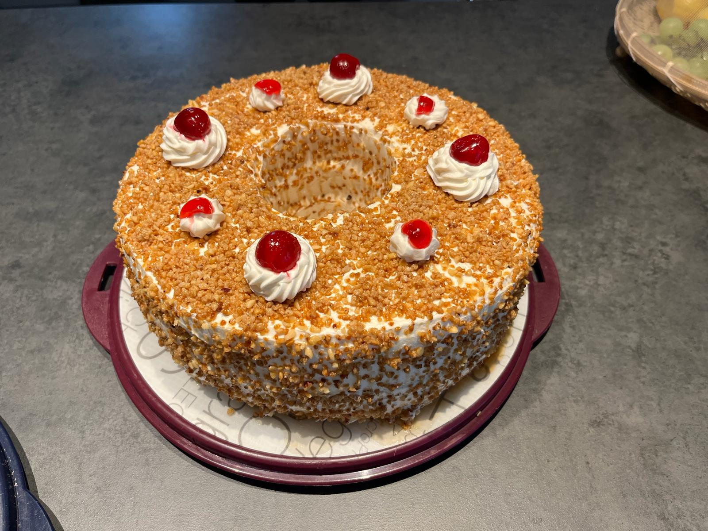

# :birthday: Frankfurt Crown Cake

## Ingredients

| Amount          | Ingredient                                          |
|-----------------|-----------------------------------------------------|
| **For the Vanilla Pudding:**                                   |
| 500 ml          | Milk                                                |
| 1 tsp           | Butter                                              |
| 1 packet        | Vanilla Pudding Powder                             |
| 75 g            | Sugar                                               |
| **For the Sponge Cake:**                                      |
| 6               | Eggs (at room temperature)                          |
| 200 g           | Sugar                                               |
| 1 packet        | Vanilla Sugar                                       |
| 3 tbsp          | Hot Water                                           |
| Pinch           | Salt                                                |
| 50 g            | Butter                                              |
| 200 g           | All-purpose Flour (Type 405)                        |
| 75 g            | Cornstarch                                          |
| 1 tsp           | Baking Powder                                       |
| **For the Praline:**                                          |
| 200 g           | Ready-made Praline or Homemade Praline              |
|                 | (25 g Butter, 125 g coarsely ground Hazelnuts,      |
|                 | 50 g Sugar)                                         |
| **For Soaking:**                                               |
| 100 ml / 100 g  | Water                                               |
| 1 heaping tbsp / 25 g | Sugar                                         |
| 3 tbsp          | Kirsch (Cherry Brandy), if desired                  |
| **For the Buttercream:**                                      |
| Prepared        | Vanilla Pudding (at room temperature)               |
| 250 g           | Butter (at room temperature)                        |
| **Additionally:**                                              |
| 125 g           | Lingonberry Jam or Red Currant Jelly                |
| 16              | Glazed Cherries                                     |

## Instructions

##### Prepare Vanilla Pudding:
1. In a saucepan, cook the vanilla pudding according to package instructions with 1 teaspoon of butter and 75 g of sugar. Let the pudding cool to room temperature.

##### Prepare Sponge Cake:
1. Preheat the oven to 160°C (convection) or 180°C (top/bottom heat).
2. Grease a Frankfurt Crown cake pan (approximately 26 cm in diameter) with butter and dust with flour.
3. In a mixing bowl, beat eggs, 200 g sugar, vanilla sugar, hot water, and salt with a kitchen machine or hand mixer for at least 6 minutes, preferably 10 minutes until frothy.
4. Gently heat 50 g butter until melted.
5. In a separate bowl, mix all-purpose flour, cornstarch, and baking powder. Sift over the egg mixture and fold in gently with a spoon.
6. Gently fold in the melted butter.
7. Pour the sponge cake batter into the prepared pan and bake immediately in the preheated oven for about 35 to 40 minutes.
8. Immediately turn out the sponge cake from the Frankfurt Crown cake pan after baking.

##### Prepare Praline:
1. In a saucepan, heat 25 g butter. Add coarsely ground hazelnuts and 50 g sugar. Roast while stirring until the sugar caramelizes and the praline becomes crispy. Be careful not to let it get too dark.

##### Prepare Soaking Syrup:
1. Boil 100 ml water with 25 g sugar for the soaking syrup. Let it cool, and stir in Kirsch if desired.

##### Prepare Buttercream:
1. The butter and the prepared vanilla pudding should be at room temperature.
2. Briefly beat the pudding with a hand mixer.
3. Beat 250 g butter for 5 minutes until creamy.
4. Add the vanilla pudding spoonful by spoonful to the butter, while continuing to beat steadily.

##### Assemble Frankfurt Crown Cake:
1. Cut the cooled sponge cake into two layers, creating three rings.
2. Drizzle the bottom part with a third of the soaking syrup.
3. Spread buttercream and half of the jam or jelly on top of the buttercream.
4. Place the middle sponge cake ring on top and repeat the process.
5. Drizzle the underside of the top ring with the remaining soaking syrup and place it on top.
6. Spread a thin layer of the remaining buttercream all around the Frankfurt Crown cake and sprinkle the praline over it.
7. Finally, decorate the Frankfurt Crown cake with buttercream rosettes and place a glazed cherry on each rosette.

##### Chill and Serve:
1. Chill the Frankfurt Crown cake for at least one hour before serving.

Enjoy your baking experience! :cake:
