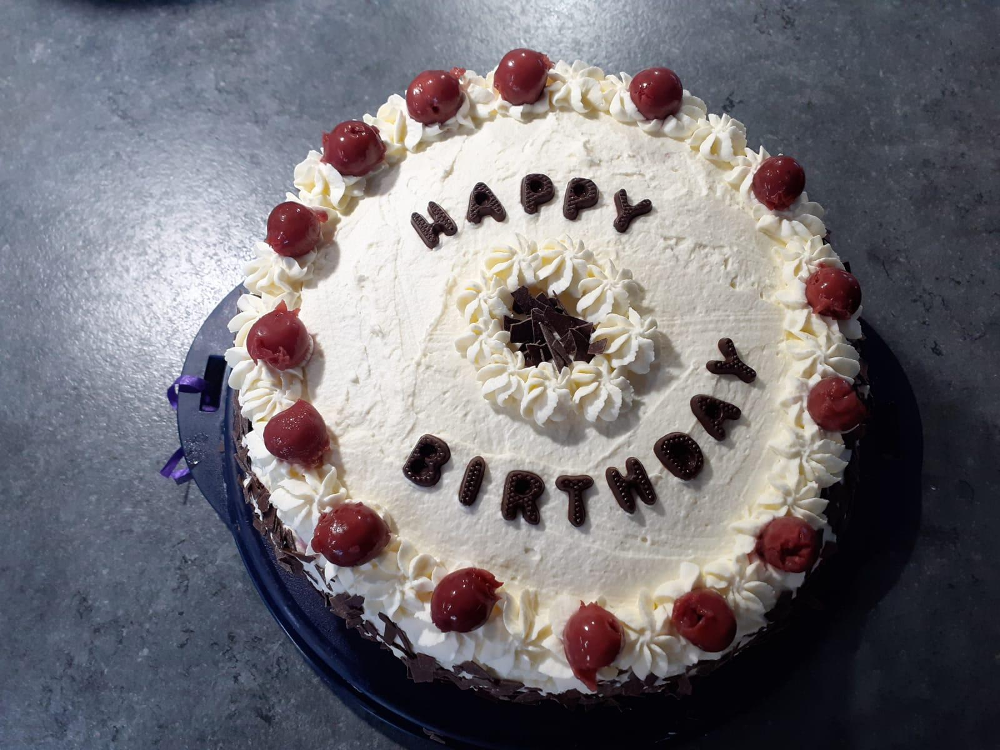

# 🍒 Black Forest Cake

- **Servings:** 12 slices
- **Cooking Time:** 40 minutes

## Ingredients

| Amount   | Ingredient                                      |
|----------|-------------------------------------------------|
| 150 g    | Dark chocolate (at least 45% cocoa content)    |
| 75 g     | Butter                                          |
| 6        | Eggs                                            |
| 175 g    | Sugar                                           |
| 100 g    | Flour (Type 405)                                |
| 25 g     | Cornstarch                                      |
| 25 g     | Cocoa powder                                    |
| 2 tsp    | Baking powder                                   |
| 1 jar    | Sour cherries (370 g drained weight)           |
| 3 tbsp   | Sugar                                           |
| 30 g     | Cornstarch                                      |
| 100 ml   | Kirsch (cherry brandy)                          |
| 800 g    | Whipping cream                                  |
| 2 packs  | Whipped cream stabilizer                        |
| 50 g     | Dark chocolate (at least 45% cocoa content)    |
|          | Baking paper for the cake pan                   |

## Instructions

1. **Preheat Oven**:
   - Preheat the oven to 180°C (160°C fan). Line the bottom of a springform pan (26 cm diameter) with baking paper.

2. **Prepare the Cake Batter**:
   - Chop the chocolate and melt it with butter in a double boiler. Separate the eggs. Beat the egg whites with 50 g of sugar until stiff peaks form. Beat the egg yolks with the remaining sugar until creamy. Stir in the melted chocolate mixture, then fold in the beaten egg whites. Mix flour, cornstarch, cocoa, and baking powder, sift over the batter, and gently fold in. Pour the batter into the prepared pan and bake in the preheated oven (middle rack) for about 40 minutes. Remove from the oven and let it cool.

3. **Prepare the Filling**:
   - Drain the cherries, reserving the juice. Set aside 12 cherries for decoration. Boil 250 ml of cherry juice (you can supplement with water) with 1 tablespoon of sugar. Mix the cornstarch with 5 tablespoons of juice or water until smooth, then stir into the boiling juice and cook until thickened. Stir in 1 tablespoon of kirsch and the cherries. Let the mixture cool.

4. **Assemble the Cake**:
   - Remove the cake from the pan and cut horizontally into two layers. Drizzle each layer with the remaining kirsch. Whip the cream with the remaining sugar and whipped cream stabilizer until stiff peaks form. Transfer a quarter of the whipped cream into a piping bag fitted with a large star tip and refrigerate. Place the bottom cake layer back into the springform pan, thinly spread with whipped cream, and spread the cherry filling on top. Place the middle cake layer on top, spread with half of the remaining whipped cream, and cover with the third cake layer. Press lightly.

5. **Finish the Cake**:
   - Release the cake from the pan and spread the remaining whipped cream all over the cake. Decorate with whipped cream rosettes and cherries. Use a small knife to grate the chocolate directly onto the surface and edges of the cake. Chill the cake for at least 2 hours before serving.

Enjoy your delicious Black Forest Cake! 🍰
